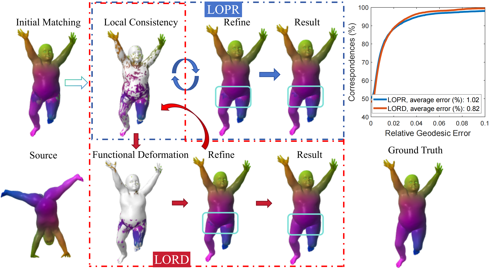
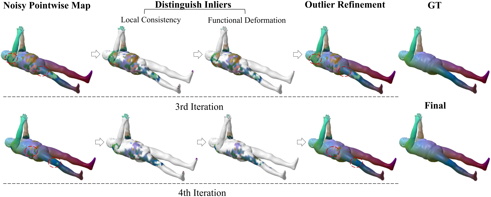

# LORD
Code of Locality Optimization Refinement with Deformation for Shape Matching via Functional Maps
This repository provides the implementation of **LOPR**, an extended version of our AAAI conference paper.

- 📄 Paper: [Google Scholar]([https://ojs.aaai.org/index.php/AAAI/article/view/28438])
- 💻 Code: [GitHub](https://github.com/XiaYifan1999/LOPR)

- ## Extention
<p align="center">
  
</p>

## Demo
Run demo_deformField.m via MATLAB. Note that the size of the shape data imposes requirements on computational memory.

- ## Overview
<p align="center">
  
</p>

If you find this project useful, please cite:

```
@article{xia2026locality,
  title={Locality Optimization Refinement with Deformation for Shape Matching via Functional Maps},
  author={Xia, Yifan and Ma, Jiayi},
  journal={International Journal of Computer Vision},
  volume={134},
  number={2},
  pages={76},
  year={2026},
  publisher={Springer}
}
```

# Dataset

The dataset is currently under preparation and will be released in the future.
